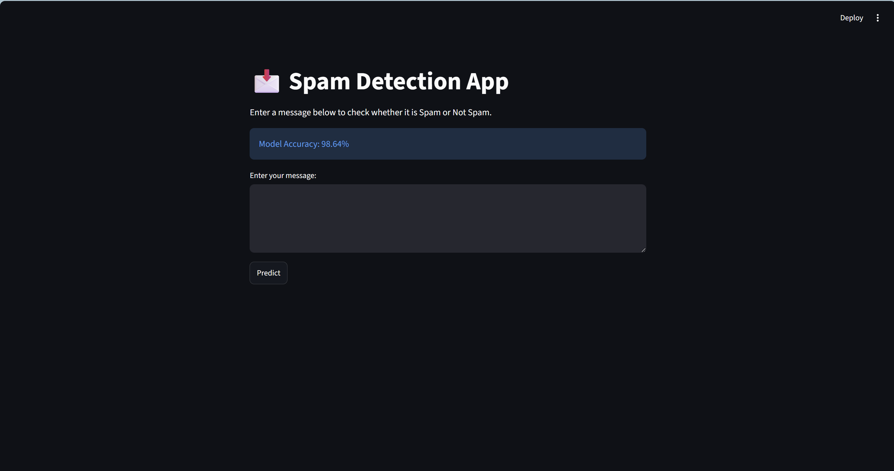
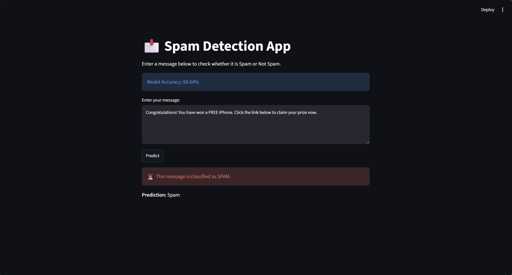
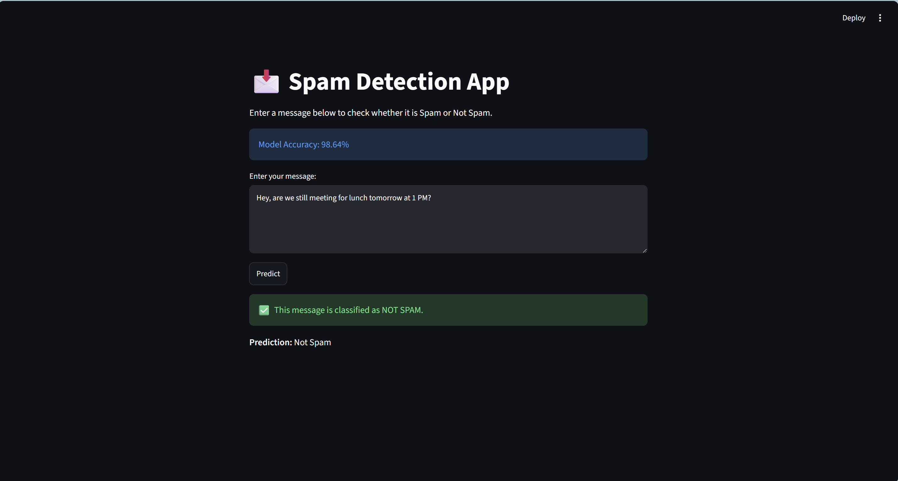

# 📩 Smart SMS Spam Detector


🚀 A Machine Learning-powered web application that classifies SMS messages as **Spam** or **Not Spam** using Natural Language Processing (NLP) and the Multinomial Naive Bayes algorithm.

---

## 🌟 Project Status

✅ Completed  
✅ Open Source  
✅ Portfolio Project  
✅ Streamlit Ready

---

# 🏷️ Repository Topics

Machine Learning • Spam Detection • NLP • SMS Classification • Streamlit • Scikit-Learn • Python • Text Analytics • Naive Bayes

---

# 🎯 Project Summary

Smart SMS Spam Detector is a machine learning application that classifies SMS messages as Spam or Not Spam using Natural Language Processing (NLP), CountVectorizer, and Multinomial Naive Bayes. The project demonstrates an end-to-end machine learning workflow from data preprocessing and model training to deployment with Streamlit.

---

## 📸 Preview

### Dashboard



### Spam Detection



### Not Spam Detection



---

# 📖 Overview

Smart SMS Spam Detector is a Machine Learning-powered text classification platform designed to identify spam and legitimate SMS messages in real time. The application leverages Natural Language Processing (NLP), CountVectorizer, and Multinomial Naive Bayes to classify messages with high accuracy through an interactive Streamlit interface.

---

# 💡 Why This Project?

Spam messages are one of the most common forms of unsolicited digital communication. This project demonstrates how Machine Learning and Natural Language Processing can be used to automatically classify SMS messages and improve communication security through intelligent text analysis.

---

# 🎯 Project Objectives

* Detect spam SMS messages using Machine Learning.
* Apply NLP techniques for text preprocessing.
* Build a real-time classification system.
* Provide an intuitive user interface with Streamlit.
* Demonstrate practical applications of text classification.

---

# ✨ Key Features

## 📧 SMS Classification

Analyze SMS messages and classify them as:

* Spam
* Not Spam

### Capabilities

* Real-Time Prediction
* Text Classification
* Interactive User Input
* Fast Response Time

---

## 🧠 Machine Learning Model

The application utilizes:

* CountVectorizer
* Multinomial Naive Bayes
* Train-Test Split Validation

## Workflow

* Data Cleaning
* Feature Extraction
* Model Training
* Performance Evaluation
* Prediction Generation

---

## 📊 Interactive Dashboard

Built with Streamlit for a simple and user-friendly experience.

### Features

* Message Input Box
* Prediction Results
* Accuracy Display
* Responsive Interface

---

# 🔄 System Workflow

```text
SMS Message
     │
     ▼
Text Preprocessing
     │
     ▼
CountVectorizer
     │
     ▼
Multinomial Naive Bayes
     │
 ┌───┴───┐
 ▼       ▼
Spam  Not Spam
     │
     ▼
Prediction Output
```

---

# 🧪 Example Predictions

### Spam

Input:

Congratulations! You have won a FREE iPhone.

Prediction:

🚨 Spam

### Not Spam

Input:

Are we still meeting tomorrow at 2 PM?

Prediction:

✅ Not Spam

---

# 📁 Project Structure

```text
smart-sms-spam-detector/
│
├── Spam_Detection.py
├── spam.csv
├── requirements.txt
├── README.md
├── .gitignore
│
└── screenshots/
    ├── dashboard.png
    ├── spam_prediction.png
    └── not_spam_prediction.png
```

---

# 🛠️ Technology Stack

## Programming Language

* Python 3

## Machine Learning

* Scikit-Learn
* Multinomial Naive Bayes
* CountVectorizer

## Data Processing

* Pandas

## Web Framework

* Streamlit

---

# 💼 Skills Demonstrated

- Machine Learning
- Natural Language Processing (NLP)
- Data Preprocessing
- Feature Engineering
- Text Classification
- Streamlit Development
- Model Evaluation
- Python Programming
- Git & GitHub

---

# 📦 Requirements

- Python 3.10+
- Pandas
- Scikit-Learn
- Streamlit

---

# ⚙️ Installation

## Clone Repository

```bash
git clone https://github.com/asif-visionary/smart-sms-spam-detector.git
cd smart-sms-spam-detector
```

## Create Virtual Environment

```bash
python -m venv venv
```

### Windows

```bash
venv\Scripts\activate
```

### Linux / macOS

```bash
source venv/bin/activate
```

## Install Dependencies

```bash
pip install -r requirements.txt
```

---

# ▶️ Usage

Run the Streamlit application:

```bash
streamlit run Spam_Detection.py
```

Open the application in your browser:

```text
http://localhost:8501
```

---

# 📊 Model Information

| Component                | Technique                  |
| ------------------------ | -------------------------- |
| Feature Extraction       | CountVectorizer            |
| Classification Algorithm | Multinomial Naive Bayes    |
| Train-Test Split         | 80% Training / 20% Testing |
| Evaluation Metric        | Accuracy                   |

---

# 📈 Model Performance

| Metric | Score |
|--------|--------|
| Accuracy | 98.64% |

---

# 📚 Dataset Information

| Attribute | Value |
|-----------|-------|
| Total Messages | 5,572 |
| Spam Messages | 747 |
| Legitimate Messages | 4,825 |
| Dataset Type | SMS Text Messages |
| Classification Type | Binary Classification |

---

# 🎓 Learning Outcomes

This project demonstrates practical experience with:

* Machine Learning
* Natural Language Processing
* Text Classification
* Data Cleaning
* Feature Engineering
* Model Evaluation
* Streamlit Deployment
* Python Development

---

# 🚀 Future Enhancements

Potential improvements include:

* TF-IDF Vectorization
* Model Persistence using Joblib
* Deep Learning Models (LSTM/BERT)
* Probability-Based Predictions
* Multi-Language Spam Detection
* Cloud Deployment
* Email Spam Detection Support

---

# 🏆 Project Highlights

- Developed an NLP-based SMS spam detection system using Scikit-Learn.
- Achieved high classification accuracy using CountVectorizer and Multinomial Naive Bayes.
- Built an interactive Streamlit dashboard for real-time predictions.
- Implemented data preprocessing and duplicate removal to improve model performance.
- Demonstrated end-to-end Machine Learning workflow from training to deployment.

---

# ⚠️ Disclaimer

This project is intended for educational and learning purposes. Predictions are generated using a Machine Learning model and may not always perfectly classify every message.

---

# 📜 License

This project is licensed under the MIT License.

---

# 👨‍💻 Author

**Mohamed Asif**

Aspiring AI & Cybersecurity Engineer

🔗 LinkedIn: https://www.linkedin.com/in/mohamed-asif-a-852830326/

💻 GitHub: https://github.com/asif-visionary

---

# ⭐ Support

If you found this project useful, consider giving it a star on GitHub.

---

# 🤝 Contributions

Contributions, suggestions, and feedback are welcome.

1. Fork the repository
2. Create a feature branch
3. Commit your changes
4. Push the branch
5. Open a Pull Request

Happy Coding! 🚀
